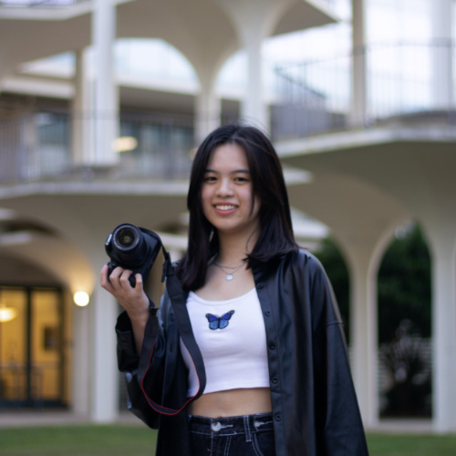
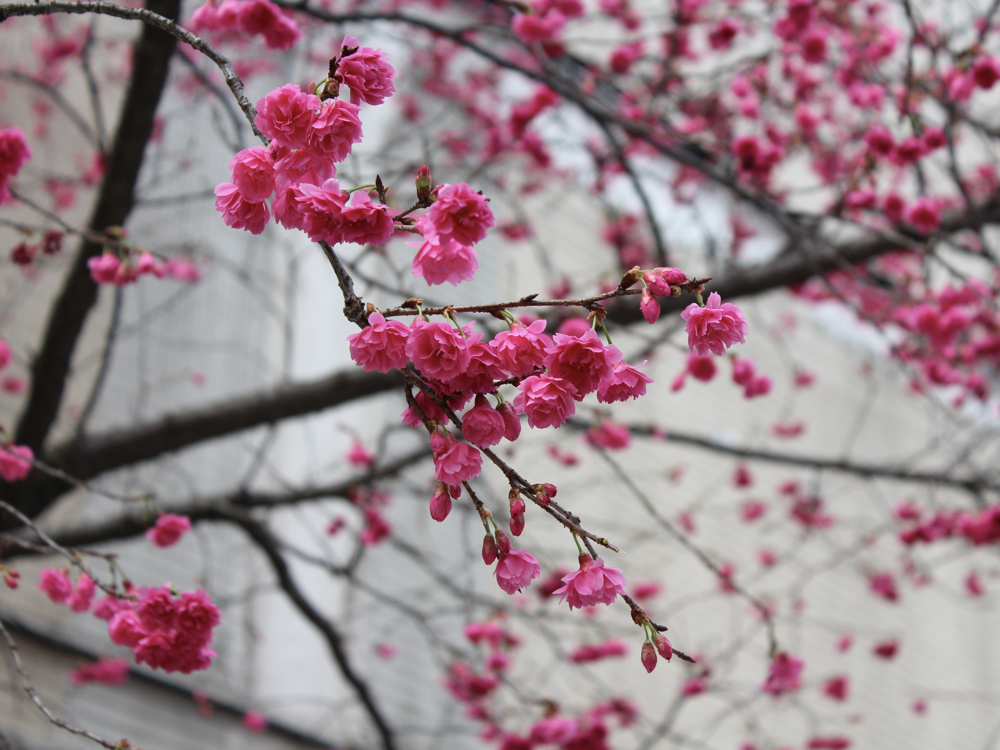

## Contents
[Introduction](#dorothy-chou)

[Programming Languages](#programming-languages)

[My Hobbies](#my-hobbies)

[Gallery](#my-photo-gallery)

[To-Do List](#my-to-do-list)

# Dorothy Chou


Hello! My name is **Dorothy Chou**. I am a third year student at *University of California, San Diego* pursuing a major in Mathematics-Computer Science and minor in Interaction Design. ~~Please ignore this sentence.~~

## Programming Languages
Some programming languages I am familiar with are:
- C++
- Java
- Python
  
Some commands that were used the most often in the creation this page are:
```
git add
git commit
git push
```
`git checkout` and `git status` were also used.

## My Hobbies
1. Photography
2. Painting
3. Listening to music

## My Photo Gallery
Below are some of the photos I have taken!



> This photo was taken in *Taipei, Taiwan*.


> This photo was taken at the *San Diego International Airport*.

You can find more of my photos [here](https://drive.google.com/drive/folders/1tk9fyCEyBG6v6qxBOdTR9YR4Tp2Bj06-?usp=sharing).


## My To-Do List
[x] CSE 110 Lab Week 1: VSCode, Markdown, and Git Part 1

[ ] CSE 110 Individual Engineer Statement

[ ] CSE 110 Fill out Individual and Team Survey